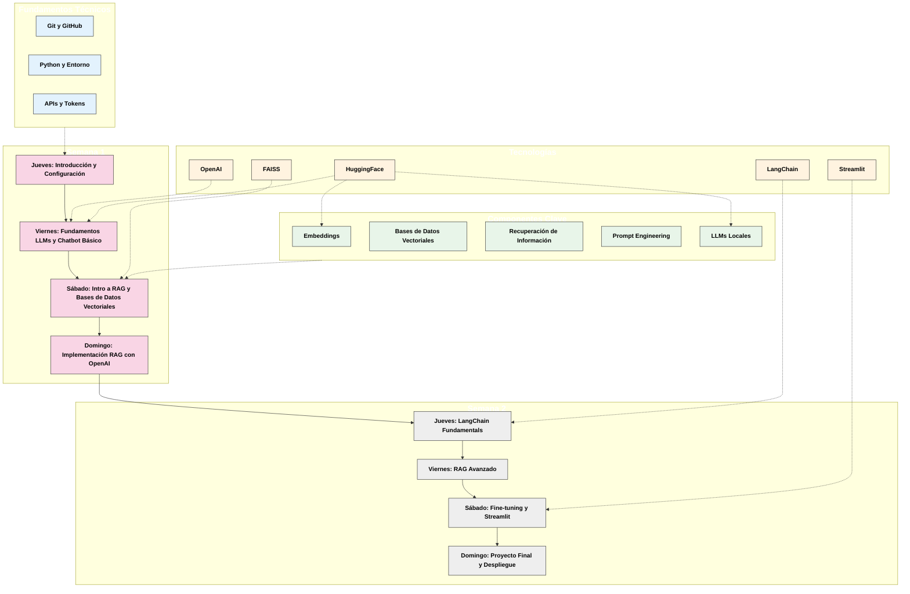
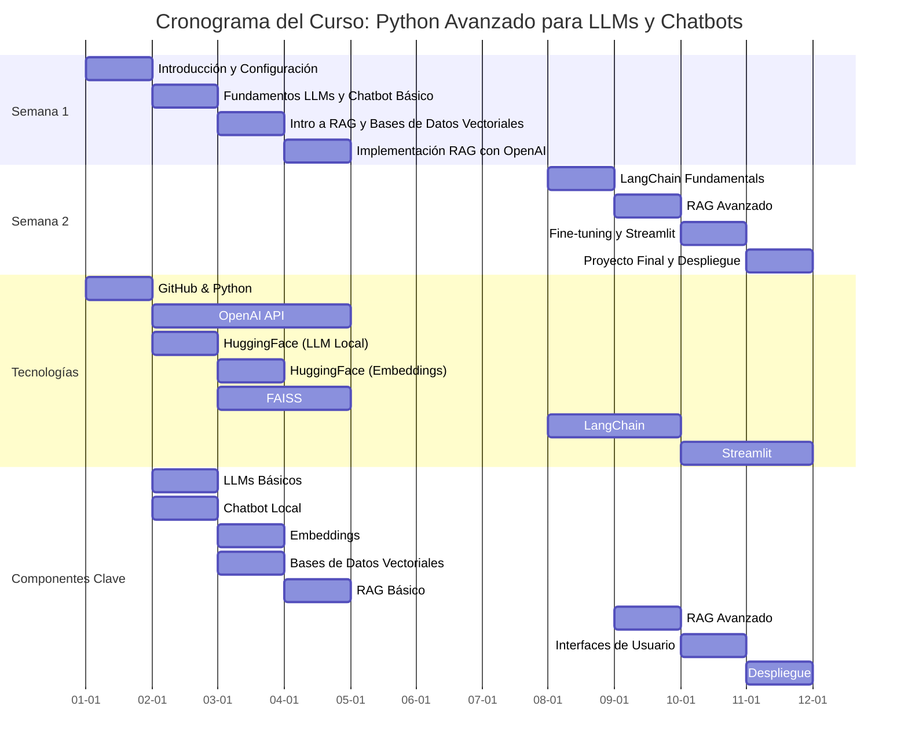

# Curso Avanzado: Python para LLMs y Chatbots

## 🚀 Descripción General

Este curso está diseñado para desarrolladores que desean profundizar en la implementación de sistemas de Inteligencia Artificial basados en Modelos de Lenguaje de Gran Escala (LLMs). A través de un enfoque práctico, los participantes aprenderán a construir chatbots avanzados utilizando técnicas de Retrieval-Augmented Generation (RAG), trabajar con bases de datos vectoriales, y desplegar aplicaciones de IA en entornos de producción.

## 🎯 Objetivos del Curso

- **Entender toda la potencialidad de la plataforma de OpenAI**:
  - Diferencias entre GPTs y Asistentes
  - Uso avanzado de la API

- **Dominar la implementación de sistemas RAG** utilizando:
  - API de OpenAI
  - LangChain como framework de integración

- **Comprender y aplicar técnicas de fine-tuning** para modelos de lenguaje

- **Desarrollar chatbots avanzados** con capacidades de recuperación de información contextual

- **Implementar bases de datos vectoriales con FAISS** para búsqueda semántica eficiente

- **Desplegar aplicaciones de IA** en plataformas como:
  - Streamlit para interfaces de usuario
  - AWS EC2 para entornos de producción

## 📋 Requisitos Previos

- **Conocimientos básicos de Python y ChatGPT**
  - Idealmente conocer ChatGPT y la plataforma de OpenAI

- **Cuenta en OpenAI con acceso a API**
  - Se proporcionarán instrucciones para configurarla durante el curso

- **Deseable pero no imprescindible**: cuenta de GitHub
  - Se puede crear durante el curso

- **Opcional**: cuenta en AWS u otro proveedor de cloud
  - Útil para la sección de despliegue

## 📚 Estructura del Curso

El curso está organizado en 8 sesiones distribuidas en 2 semanas:

### Semana 1
- **Jueves**: Introducción y Configuración del Entorno
- **Viernes**: Fundamentos de LLMs y Chatbot Básico
- **Sábado**: Introducción a RAG y Bases de Datos Vectoriales
- **Domingo**: Implementación de RAG con OpenAI

### Semana 2
- **Jueves**: Fundamentos de LangChain
- **Viernes**: RAG Avanzado
- **Sábado**: Fine-tuning y Streamlit
- **Domingo**: Proyecto Final y Despliegue

El cronograma del curso muestra cómo este módulo encaja en la secuencia de aprendizaje:

## 🛠️ Tecnologías y Herramientas

- **Lenguajes**: Python 3.12
- **Gestión de Entornos**: UV (gestor de paquetes moderno)
- **Control de Versiones**: Git y GitHub
- **APIs y Modelos**:
  - OpenAI (GPT-4o/4o-mini)
  - HuggingFace (para embeddings y LLMs locales)
- **Frameworks**:
  - LangChain (para integración de componentes)
  - FAISS (para bases de datos vectoriales)
  - Streamlit (para interfaces de usuario)

## 💻 Contenido del Repositorio

Este repositorio contiene todos los recursos necesarios para seguir el curso:

- `/src`: Código fuente organizado por módulos
  - `/chatbots`: Implementaciones de chatbots básicos y avanzados
  - `/rag`: Ejemplos de sistemas RAG
  - `/config`: Configuraciones del proyecto
  - `/local_llm`: Implementación de modelos locales
  - ~~`/proyecto_code`: Proyecto de asistente de código avanzado~~ En desarrollo

- `/data`: Datos de ejemplo para práctica

## 🧩 Metodología

El curso combina:
- Exposiciones teóricas con PowerPoint
- Demostraciones en vivo
- Ejercicios prácticos guiados
- Desarrollo de un proyecto final integrador

## 🔍 Proyecto Final

El curso culmina con el desarrollo de un chatbot RAG completo que puede:
1. Procesar documentos específicos
2. Indexar la información en una base de datos vectorial
3. Responder preguntas utilizando la información relevante
4. Ofrecer una interfaz de usuario amigable con Streamlit
5. Ser desplegado en un entorno de producción

## 🌟 ¿Por qué tomar este curso?

- **Enfoque práctico**: Aprenderás haciendo, no solo viendo
- **Tecnologías actuales**: Utilizarás las herramientas más modernas del mercado
- **Aplicación inmediata**: Conocimientos aplicables a casos de uso reales
- **Proyecto completo**: Terminarás con un producto funcional que podrás mostrar

## 🚀 Preparación para el Curso

1. Asegúrate de tener Python 3.12 instalado
2. Crea o ten a mano tu cuenta de OpenAI
3. Prepara tu entorno de desarrollo (IDE recomendado: Cursor)
4. ¡Trae tu entusiasmo y curiosidad por la IA!

---

## ⚠️ Importante

Para aprovechar al máximo este curso, es recomendable seguir cada sesión y realizar los ejercicios prácticos. La construcción de sistemas basados en LLMs requiere práctica y experimentación constante.

---

*Curso desarrollado por Datoscout - Expertos en Inteligencia Artificial y Procesamiento de Lenguaje Natural*
