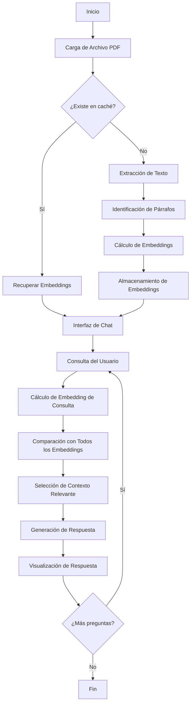

# Sistema RAG Básico para Recuperación y Generación de Respuestas

Este módulo implementa un sistema básico de Recuperación Aumentada de Generación (RAG) utilizando Streamlit. El sistema permite cargar documentos PDF, extraer su contenido, calcular embeddings semánticos y responder preguntas basadas en el contenido del documento.

## Descripción General

El sistema RAG (Retrieval Augmented Generation) es una técnica que combina la recuperación de información con la generación de respuestas basadas en lenguaje natural. Esta implementación básica sirve como punto de partida para comprender los fundamentos de los sistemas RAG.

## Flujo del Sistema

## Procedimiento del Sistema

### 1. Carga y Procesamiento de Documentos

1. **Carga del archivo PDF**: El usuario sube un archivo PDF a través de la interfaz de Streamlit.
2. **Verificación de caché**: El sistema verifica si el documento ya ha sido procesado anteriormente.
   - Si existe, recupera los embeddings almacenados.
   - Si no existe, procede con la extracción del texto.
3. **Extracción de texto**:
   - El archivo se convierte temporalmente para su procesamiento.
   - Se extrae el texto de cada página (hasta un máximo definido).
   - El texto se divide en párrafos para su procesamiento individual.

### 2. Generación de Embeddings

1. **Procesamiento de párrafos**: Cada párrafo extraído del PDF se considera como un documento independiente.
2. **Cálculo de embeddings**: Utilizando un modelo de embeddings, se convierte cada párrafo en un vector numérico que representa su significado semántico.
3. **Almacenamiento**: Los embeddings generados se almacenan en un DataFrame junto con metadatos como:
   - Número de página
   - Número de párrafo
   - Texto original
   - Vector de embedding

### 3. Sistema de Recuperación

El sistema implementa un método naive pero efectivo para la recuperación de información:

1. **Recepción de consulta**: El usuario realiza una pregunta a través de la interfaz de chat.
2. **Vectorización de la consulta**: La pregunta se convierte en un vector de embedding.
3. **Cálculo de similitud**: Se compara el embedding de la consulta con TODOS los embeddings almacenados mediante similitud coseno.
   - Esta es una implementación básica que no utiliza índices avanzados.
   - La comparación se realiza de manera exhaustiva con todos los párrafos almacenados.
4. **Selección de contexto**: Se seleccionan los párrafos más relevantes según su puntuación de similitud.
   - Se filtra según un umbral mínimo de similitud.
   - Se seleccionan los párrafos más similares.

### 4. Generación de Respuestas

1. **Composición de contexto**: Los párrafos seleccionados se unen para formar el contexto.
2. **Generación de respuesta**: Se utiliza un modelo de lenguaje para generar una respuesta basada en:
   - La pregunta del usuario
   - El contexto recuperado
3. **Presentación**: La respuesta se muestra de forma gradual (streaming) en la interfaz.
4. **Referencias**: Se incluyen referencias a las fuentes utilizadas (página y sección).

## Características Clave

- **Sistema de caché**: Evita reprocesar documentos ya analizados.
- **Similitud semántica**: Utiliza similitud coseno para comparar vectores.
- **Interfaz amigable**: Implementada con Streamlit para facilitar la interacción.
- **Respuestas fluidas**: Las respuestas se presentan de forma gradual (efecto de streaming).
- **Almacenamiento flexible**: Capacidad para almacenar localmente o en la nube (AWS S3).

## Limitaciones

- Sistema de recuperación naive: Compara con todos los embeddings en lugar de usar índices avanzados.
- Número limitado de páginas procesadas.
- No mantiene memoria de conversación entre preguntas.
- No implementa re-ranking u otras técnicas avanzadas.

Este sistema básico sirve como punto de partida para comprender cómo funcionan los sistemas RAG y puede evolucionar hacia implementaciones más sofisticadas con índices vectoriales, reranking y otras mejoras.
